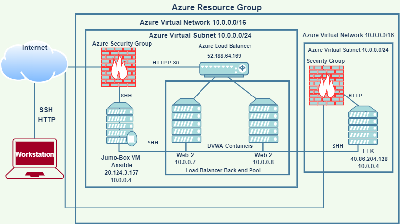

### Automated ELK Stack Deployment

The files in this repository were used to configure the network depicted below.

These files have been tested and used to generate a live ELK deployment on Azure. They can
be used to either recreate the entire deployment pictured above. Alternatively, select 
portions of the  file may be used to install only certain pieces of it, such as Filebeat.

  -  The playbook file._
  ---
- name: Configure Elk VM with Docker
  hosts: elk
  remote_user: sysadmin
  become: true
  tasks:
      Use apt module
    - name: Install docker.io
      apt:              
        update_cache: yes
        force_apt_get: yes
        name: docker.io 
        state: present
                       
        Use apt module 
    - name: Install python3-pip
      apt:
        force_apt_get: yes
        name: python3-pip
        state: present

        Use pip module (It will default to pip3)
    - name: Install Docker module
      pip:
        name: docker
        state: present
   
       Use command module
    - name: Increase virtual memory
      command: sysctl -w vm.max_map_count=262144

       Use sysctl module
    - name: Use more memory
      sysctl:
        name: vm.max_map_count
        value: "262144"
        state: present
        reload: yes

       Use docker_container module
    - name: download and launch a docker elk container
      docker_container:
        name: elk
        image: sebp/elk:761
        state: started
        restart_policy: always
         Please list the ports that ELK runs on
        published_ports:
          -  5601:5601
          -  9200:9200
          -  5044:5044

        Use systemd module
    - name: Enable service docker on boot
      systemd:
        name: docker
        enabled: yes

This document contains the following details:
- Description of the Topology
- Access Policies
- ELK Configuration
  - Beats in Use
  - Machines Being Monitored
- How to Use the Ansible Build

### Description of the Topology

The main purpose of this network is to expose a load-balanced and monitored instance of DVWA, the D*mn Vulnerable Web Application.

Load balancers ensures that the application will be highly available, in addition to restricting any DDOS attack to the network.
The Jump box provides security architecture by controlling access to other machines by allowing connections from specific IP 
adresses, acting similar to a gateway router as an origination point to connect to other servers.

Integrating an ELK server allows users to easily monitor the vulnerable VMs for changes to the Filebeatand system Metricbeat.

-Filebeat continues monitoring the system for any change.
-Metricbeat helps you monitor your servers by collecting 
 metrics from the system and services running on the server, 
 such as: MySQL, HAProxy, Nginx, Apache ect...

The configuration details of each machine may be found below.

| Name      | Function | IP Address | Operating System |
|---------- |----------|------------|------------------|
| TheJumpBox| Gateway  | 10.0.0.1   | Linux            |
| Web-1     | Webserver| 10.0.0.7   | Linux            |
| Web-2     | Webserver| 10.0.0.8   | Linux            |
| ElkVM     |   Elk    | 10.1.0.4   | Linux            |

### Access Policies

The machines on the internal network are not exposed to the public Internet. 

Only the Jump-box machine can accept connections from the Internet. Access 
to this machine is only allowed from the following IP addresses.:172.97.235.52

Machines within the network can only be accessed by SSH.
The Jumpbox is only machine that can access the Elk VM using the following IP address 40.86.204.128.

A summary of the access policies in place can be found in the table below.

| Name     | Publicly Accessible | Allowed IP Addresses |
|----------|---------------------|----------------------|
| JumpBox  |     No              |  20.124.3.157        |
|  Web-1   |     No              |  10.0.0.7            |
|  Web-2   |     No              |  10.0.0.8            |                      |
|  ELK -VM |     No              |  10.1.0.4            |

### Elk Configuration

Ansible was used to automate configuration of the ELK machine. No configuration was performed manually, which is advantageous because...

The playbook implements the following tasks: it give you the ability to deploy several servers using one single playbook.
-Install docker.io
-Install docker container
-Launch docker container: Elk
-Install python-pip package

The following screenshot displays the result of running `docker ps` after successfully configuring the ELK instance.

### Target Machines & Beats
This ELK server is configured to monitor the following machines:

 Web-1 10.0.0.7 & Web-2 10.0.0.8

We have installed the following Beats on these machines:

- Metricbeat & Filebeat were successfully installed. 

These Beats allow us to collect the following information from each machine:

-Filebeat monitors specified data log or locations which is collected and delivered to Elasticsearch.
-Metricbeat collects metrics from systems and manage the statistics for every process running.

### Using the Playbook
In order to use the playbook, you will need to have an Ansible control node already configured. 
Assuming you have such a control node provisioned: 

SSH into the control node and follow the steps below:
- Copy the playbook to /etc/ansible/files/.
Update the configuration files in /etc/ansible/files by including private IP address of the Webservers and ELK VM.
Run the playbook, and navigate to http://40.86.204.128:5601/app/kibana to check that the installation worked as expected.    

* ssh username Sysadmin@JumpBox IP
* sudo docker start container name
* sudo docker attach container name
* nano /etc/ansible/hosts add additional private IPs
* ansible-playbook /etc/ansible/ install-elk-playbook.yml
* cp filebeatconfig.yml >> /etc/ansible/
* ansible-playbook /etc/ansible/roles/filebeatplaybook.yml
http://40.86.204.128:5601/app/kibana
